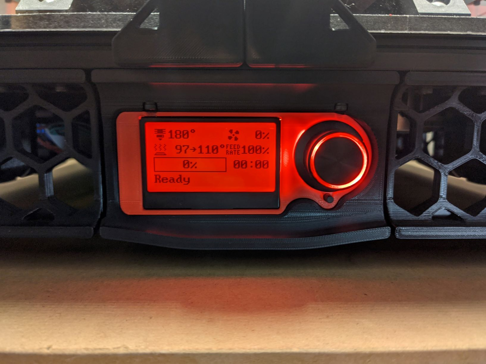
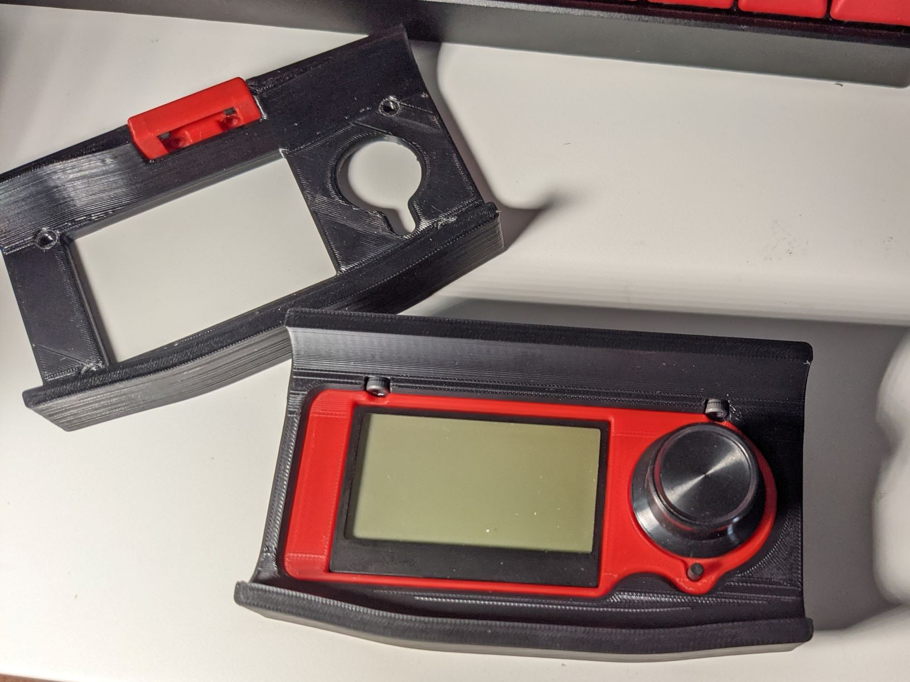

# Voron 2.4 Fixed Mini 12864 Case

This is an update to [the mod by mjoaris] which is in turn an update to [schlank's Minima case] for the V1. This update removes the hinge and mounts the case directly to the extrusion.

### BOM

Print the following:
- mini_12864_fixed_case_accent.stl
- mini_12864_fixed_case_front.stl
- mini_12864_fixed_case_rear.stl

The accent piece should naturally be printed in your Voron's accent color.

BOM:
- 2x M3x16 SHCS
- 4x M3x12 SHCS
- 4x M3 Heatsets
- 2x M3 T-Nuts
- Mini 12864 Display
- Superglue

### Assembly

1. Remove the knob from the LCD panel. 
1. Insert the M3x16 screws through the holes in the top of the case_front.
1. Use a small bit of superglue to attach the accent piece to the front of case_front.
1. Place the LCD screen into the back of case_front.
1. Affix case_rear to the back of the case using the M3x12 bolts.
1. Install in the stock location using the t-nuts according to the mnaual.
1. Install the knob on the LCD panel.
