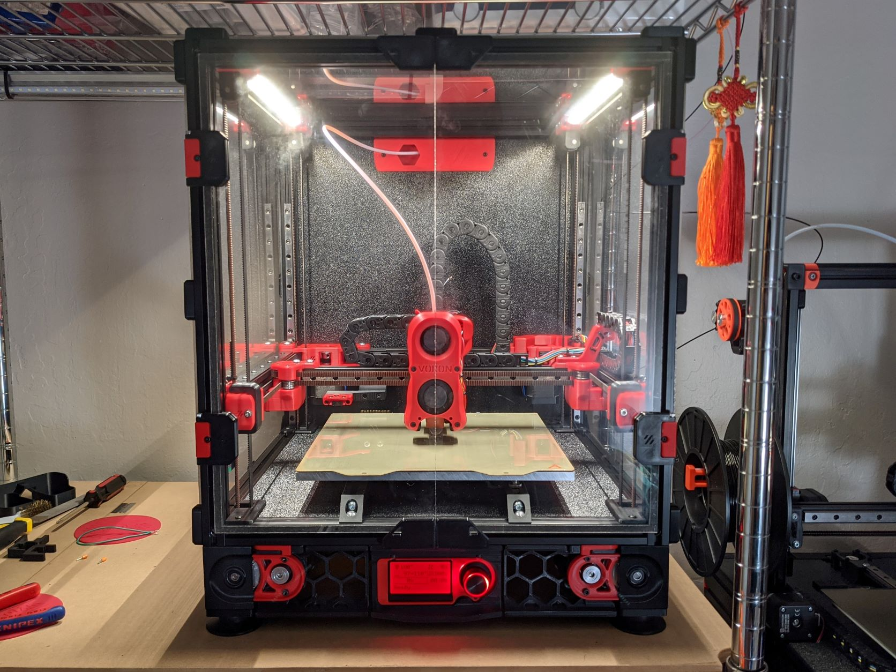

# Voron 2.4 Mods

Mods for the [Voron 2.4].

| Mod              | Description                                                   |
| ---------------- | ------------------------------------------------------------- |
| [(No) Exhaust]   | Eliminates the exhaust fan and filter.                        |
| [Fixed LCD Case] | Case for the Mini 12864 that does not pivot.                  |
| [Lighting]       | Integrated mounts for LED extrusions.                         |
| [Hinge Mod+]     | Hinges for [Randell's hinge mod] that support drop-in t-nuts. |

[(No) Exhaust]: ./exhaust/
[Fixed LCD Case]: ./lcd_module/
[Lighting]: ./lighting/
[Hinge Mod+]: ./panels/
[Voron 2.4]: https://vorondesign.com/voron2.4
[Randell's hinge mod]: https://github.com/VoronDesign/VoronUsers/tree/master/printer_mods/randell/Door_Hinges
